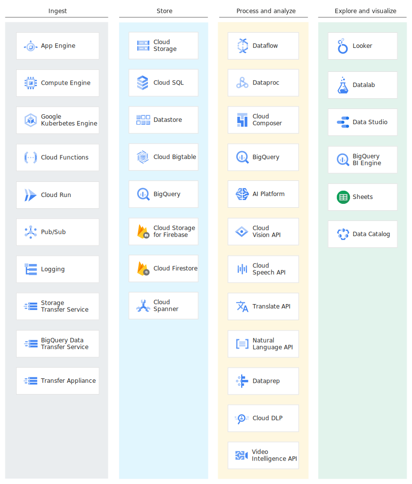
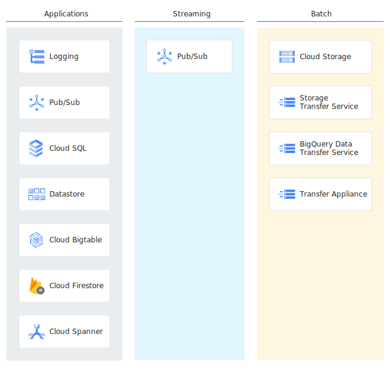
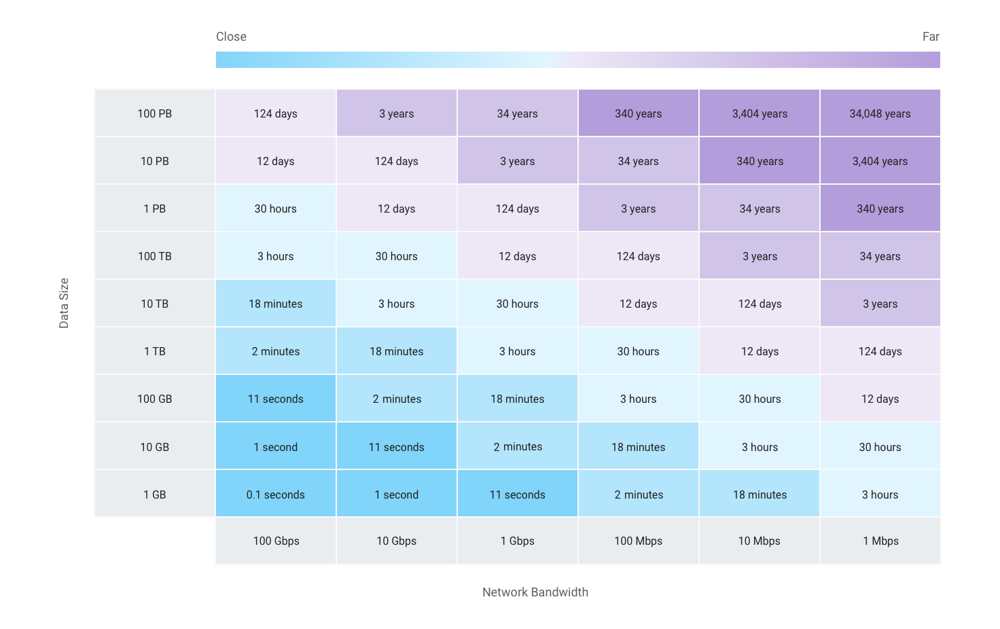
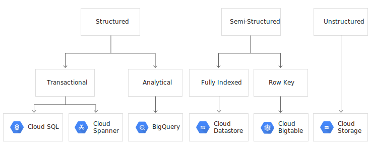
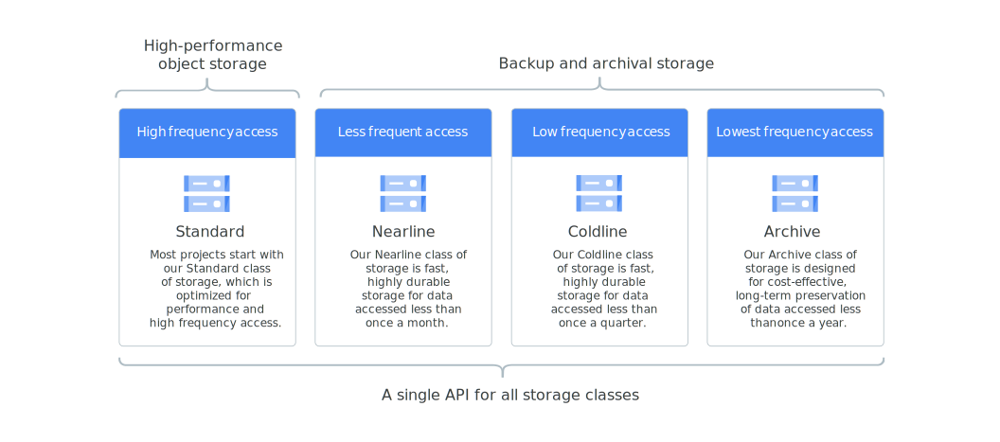
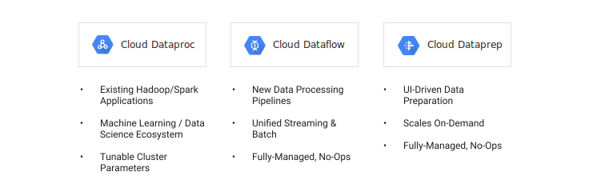
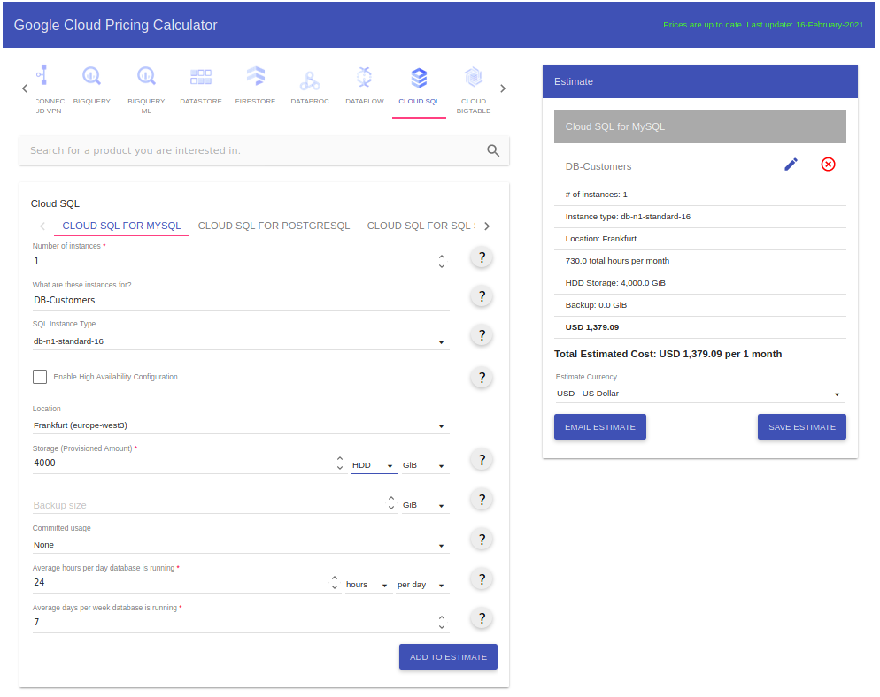
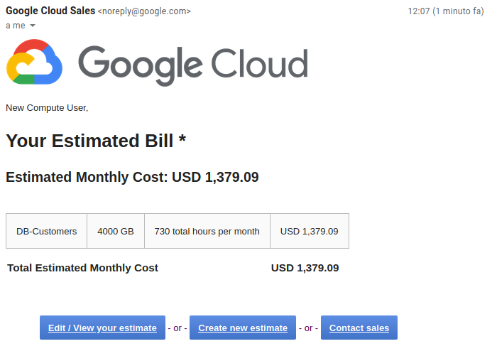

# Google Cloud Platform - Ingestion & Store Theory

## Why choosing a cloud architecture like GCP ?

- __scalable infrastructure__: you can "rent" more computation if you need it, and it's nearly instantaneous

- __pay-as-you-go pricing__: you only pay for the services you use. No upfront costs. No termination fees.

- __Serverless__: you can go from prototyping to production on a global scale, without worrying about data centers' main issues like physical installation, capacity, reliability, or performance.

- __Advanced analytics__: provides tools for big data analysis and storage

- __Future-proof technologies__: you can use the latest softwares which are constantly updated to the latest version available on the market

## The four steps of the data lifecycle in GCP

The data lifecycle has four steps.

1. __Ingest__: The first stage is to pull in the raw data, such as streaming data from devices, on-premises batch data, app logs, or mobile-app user events and analytics.

2. __Store__: After the data has been retrieved, it needs to be stored in a format that is durable and can be easily accessed.

3. __Process and analyze__: In this stage, the data is transformed from raw form into actionable information.

4. __Explore and visualize__: The final stage is to convert the results of the analysis into a format that is easy to draw insights from and to share with colleagues and peers.

## STEP 1: Ingestion

There are several approaches you can take to collect raw data, based on the data’s size, source, and latency.

- __App data__: Data from app events, such as log files or user events, is typically collected in a push model, where the app calls an API to send the data to storage. 

- __Streaming__: The data consists of a continuous stream of small, asynchronous messages.

- __Batch__: Large amounts of data are stored in a set of files that are transferred to storage in bulk.

### 1.A App data
Apps and services generate a significant amount of data. This includes data such as app _event logs_, _clickstream data_, social network _interactions_, and e-commerce _transactions_. Collecting and analyzing this event-driven data can reveal user trends and provide valuable business insights.

[__Cloud Logging__](https://cloud.google.com/logging) is a centralized __log-management service__ that collects metrics, events, and metadata from Google Cloud Platform, Amazon Web Services, hosted uptime probes, application instrumentation, and a variety of common application components including Cassandra, Nginx, Apache Web Server, Elasticsearch, and many others. You can __export__ data collected by Cloud Logging by using built-in tools that send the data to [Cloud Storage](https://cloud.google.com/storage), [Pub/Sub](https://cloud.google.com/pubsub), and [BigQuery](https://cloud.google.com/bigquery).

<ins>Examples</ins>:

- ___Writing data to a file___: An app outputs batch CSV files to the object store of [Cloud Storage](https://cloud.google.com/storage).
- ___Writing data to a database___: An app writes data to the managed MySQL of [Cloud SQL](https://cloud.google.com/sql) or the NoSQL databases of [Cloud Datastore](https://cloud.google.com/datastore) and [Cloud Bigtable](https://cloud.google.com/bigtable).
- ___Streaming data as messages___: An app streams data to [Cloud Pub/Sub](https://cloud.google.com/pubsub/), a real-time messaging service.

### 1.B Streaming Data

Streaming data is delivered asynchronously, without expecting a reply, and the individual messages are small in size. Streaming data can be used for firing event triggers, performing complex session analysis, and as input for machine learning tasks. CGP offers [Cloud Pub/Sub](https://cloud.google.com/pubsub/) as a tool for managing streams of data.

<ins>Examples of Streaming data</ins>

- ___Telemetry data___ from Internet of Things (IoT) network-connected devices
- ___User events___ from Apps logging events (e.g., when the user opens the app and whenever an error or crash occurs)

<ins>GCP offers</ins>

- [__BigQuery Streaming Inserts__](https://cloud.google.com/bigquery/streaming-data-into-bigquery): stream your data into BigQuery one record at a time
- [__Cloud Pub/Sub__](https://cloud.google.com/pubsub/): Real-time messaging

 

#### BigQuery Streaming Inserts

stream your data into BigQuery one record at a time

Streamed data is available for real-time analysis within a few seconds of the first streaming insertion into a table.

It is indeed extraordinary for a DWH to accept Streaming Inserts, but be aware of the [quota limits](https://cloud.google.com/bigquery/quotas#streaming_inserts). They are high, but there are limits.

  - Maximum row size: 5 MB
  - HTTP request size limit: 10 MB
  - Maximum rows per second: 500,000 rows per second, per project located in `US` or `EU`
  - Maximum rows per request: 10,000 rows per request (be aware of per-request latency - too few vs too many rows)
  - Maximum bytes per second: 1 GB per second, applied project level.

Also, no at least once semantics. Make sure you understand how to [ensure data consistency](https://cloud.google.com/bigquery/streaming-data-into-bigquery#dataconsistency)

 

#### Cloud Pub/Sub

Ingest event streams from anywhere, at any scale, for simple, reliable, real-time stream analytics

- At-least-once delivery at any scale
    - Synchronous, cross-zone message replication
    - per-message receipt tracking
- Exactly-once processing via [Cloud Dataflow](https://cloud.google.com/dataflow/)
- Fully managed
    - No provisioning
    - No shards or partitions
    - Just set quota, publish and consume
- Open
    - open REST/HTTP and RPC service APIs for pulling and pushing messages
    - open-source [Apache Kafka connectors](https://github.com/GoogleCloudPlatform/pubsub/tree/master/kafka-connector) to send and receive messages
    - [JMS connector](https://www.striim.com/integrations/jms-google-cloud-pub-sub/)
- Global by default with consistent latency
    - Publish from anywhere in the world
    - consume from anywhere
    - No replication necessary
- Compliance & security
    - fine-grained access controls
    - end-to-end encryption
- Pricing for [Seek-related message storage](https://cloud.google.com/pubsub/docs/replay-overview): 0.27/GiB-month with first 10GB free (pricing [doc](https://cloud.google.com/pubsub/pricing))

### 1.C Bulk data

Bulk data consists of large datasets where ingestion requires high aggregate bandwidth between a small number of sources and the target. The data could be stored in files, such as _CSV_, _JSON_, _Avro_, or _Parquet_ files, or in a _relational_ or _NoSQL_ database. The source data could be located ___on-premises___ or on ___other cloud platforms___.

<ins>Examples</ins>:

- __BigData workloads__: ingestion of a huge JSON file containing all the customer records of a company.
- __Data migration__ to the cloud: Moving data stored in an on-premises Oracle database to a fully managed Cloud SQL database using Informatica.
- __Data Backups__ data from other cloud platforms data: Replication of an AWS bucket store to Google Cloud Storage using [Cloud Storage Transfer Service](https://cloud.google.com/storage-transfer-service).
- __Importing legacy data__: Copying ten years worth of website log data into BigQuery for long-term trend analysis.

The <ins>Size/Bandwidth tradeoff</ins>: the more the data are bigger, the more the bandwidth you need to get reasonable response times. Both storage volume and bandwidth requirements have to be carefully evaluated as they increase the cost of the cloud solution.

#### Bulk ingestion tools

- [__Storage Transfer Service__](https://cloud.google.com/storage-transfer-service): manages the ___file transfer___ from a data source (AWS S3 bucket, web-accessible URL, or another Cloud Storage bucket) to a Cloud Storage bucket. It is designed for bulk transfers and optimized for data volumes greater than 1 TB. Backing up data is a common use of Storage Transfer Service.

- [__BigQuery Data Transfer Service__](https://cloud.google.com/bigquery-transfer/docs/introduction): ___automates data movement___ from software as a service (SaaS) applications using _scheduling_ techniques. The data sources mainly belong to Google applications, but also support Amazon S3, Teradata, Amazon Redshift.

- [__gsutil__](https://cloud.google.com/storage/docs/gsutil): a ___command-line utility___ to move file-based data to a Google Cloud Storage. You can also use gsutil to create and manage Cloud Storage buckets, edit access rights of objects, and copy objects from Cloud Storage.

- ___Database migration tools___ such as [__Talend__](https://www.talend.com/) and [__Informatica__](https://www.informatica.com/products.html).

- [__Transfer Appliance__](https://cloud.google.com/transfer-appliance/docs/4.0?hl=it-IT): an high-capacity storage server (up to 1 PB) that you lease from Google. You connect it to your network, load it with data, and ship it to an upload facility where the data is uploaded to Cloud Storage.

- Google Cloud __partners solutions__:
  - [LiveMigrator](https://www.wandisco.com/products/livedata-migrator): automates the transfer of data from on-premises local and network storage into Dataproc clusters.
  - [Cloud FastPath](https://www.cloudfastpath.com/): automates data migration and local file system synchronization with Cloud Storage
  - [Iron Mountain](https://www.ironmountain.com/resources/general-articles/b/balancing-the-past-of-legacy-tape-with-the-future-of-disk-and-cloud-storage) and [Prime Focus](http://www.primefocustechnologies.com/offline-media-import-export-form): load data into Cloud Storage by sending your physical media to a third-party service provider who uploads data on your behalf.

 

__[Storage Transfer Service](https://cloud.google.com/storage-transfer-service): Managed file transfer__

- Default behavior:
    - copies a file from the data source if
        - the file doesn't exist in the data sink
        - the file differs between the version in the source and the sink
    - retain files in the source after the transfer operation
- data sources:
    - Amazon S3 buckets
    - HTTP/HTTPS locations
    - Cloud Storage buckets
- data sink:
    - always a Cloud Storage bucket
- no guarantees on latency (performance fluctuations are to be expected)
- Use cases:
    - Back up data
    - Move data between regions or between different types of Cloud Storages
- Advance jobs:
    - Schedule one-time transfer operations
    - Schedule recurring transfer operations
        - Delete existing objects in the destination bucket if they don't have a corresponding object in the source
        - Delete source objects after transferring them
        - Schedule periodic synchronization with advanced filters

 

__[BigQuery Data Transfer Service](https://cloud.google.com/bigquery-transfer/docs/introduction): Managed application data transfer__

- automated data movement from software as a service (SaaS) applications
   - managed
   - scheduled
   - lays the foundation of the data warehouse, but without the need of coding
- automatically loads data into [BigQuery](https://cloud.google.com/bigquery) on a regular basis
- example sources:
   - Google Ads
   - Google Play
   - Youtube
   - [Amazon S3](https://cloud.google.com/bigquery-transfer/docs/s3-transfer) (external)
   - [Teradata](https://cloud.google.com/bigquery-transfer/docs/teradata-migration) (Data Warehouse)
   - [Redshift](https://cloud.google.com/bigquery-transfer/docs/redshift-migration) (Data Warehouse)

 

__[gsutil](https://cloud.google.com/storage/docs/gsutil) tool__

gsutil is a ___command-line utility___ to move file-based data to a Google Cloud Storage. You can also use gsutil to create and manage Cloud Storage buckets, edit access rights of objects, and copy objects from Cloud Storage.

Usages:

  - Creating and deleting buckets
  - Uploading, downloading, and deleting objects
  - Listing buckets and objects
  - Moving, copying, and renaming objects
  - Editing object and bucket ACLs

Large community on [StackOverflow](https://stackoverflow.com/questions/tagged/google-cloud-storage+gsutil)

## STEP 2: Store

Data comes in many different shapes and sizes, and its structure is wholly dependent on the sources from which it was generated and the subsequent downstream use cases. For data and analytics workloads, ingested data can be stored in a variety of formats or locations.

### 1. Storing object data

 

__A) [Cloud Storage](https://cloud.google.com/storage/): Managed object storage__

 - offers a durable and highly-available object storage service

 - supports both __structured__ and __unstructured__ data

 - files are organized by project into individual ___buckets___

 - each bucket supports custom access control lists (ACLs) or centralized identity and access management (IAM) controls

 - can be accessed by apps and services running on [App Engine](https://cloud.google.com/appengine), [GKE](https://cloud.google.com/kubernetes-engine), or [Compute Engine](https://cloud.google.com/compute), and through other services such as [Cloud Logging](https://cloud.google.com/logging)

 

<ins>Key Features</ins>:
  - Single API across storage classes
  - highly scalable and performant
      - individual objects can be as large as 5TB
      - up to exabytes of total data
      - no limit to read frequency
      - time to the first byte in milliseconds
  - Designed for 99.999999999% durability
  - Very high availability across all storage classes (from 99,95% to 99%)
  - Strongly consistent
      - When a write succeeds, the latest copy of the object is guaranteed to be returned to any GET, globally.
      - This applies to PUTs of new or overwritten objects and DELETEs.
  - Regional(cheaper) or multi-regional storage options for every storage class
  - Can be mounted as a file system using [GCS Fuse](https://cloud.google.com/storage/docs/gcs-fuse)

 

<ins>Data storage use cases</ins>

  - data __backup__ and __disaster recovery__

  - content distribution: eg. media files

  - __ETL data__: Cloud Storage data can be accessed by Dataflow for transformation and loading into other systems such as Cloud Bigtable or BigQuery

  - data for __MapReduce jobs__: For Hadoop and Spark jobs, data from Cloud Storage can be natively accessed by using Dataproc

  - __query data__: BigQuery natively supports importing CSV, JSON, and Avro files from a specified Cloud Storage bucket

  - Seeding __machine learning__: store data and files used by the Google Cloud machine learning APIs

  - Archiving __cold data__: [Nearline, Coldline, and Archive Storage](https://cloud.google.com/storage/archival) offer low latency, lower cost storage for objects that you plan to access less than once per month/quarter/year. However, these storage classes require a [minimum storage duration](https://cloud.google.com/storage/pricing#archival-pricing) or you will have to pay an early delete penalty.

| Storage Class | Standard | Nearline | Coldline | Archive |
| ------------- | -------------- | -------- | -------- | -------- |
| `Price (multiregion)` | $0.026-$0.046 GB/month | $0.010-$0.032 GB/month | $0.007-$0.012 GB/month | $0.004-$0.0065 GB/month |
| `Price (regional)` | $0.020-$0.025 GB/month | $0.010-$0.016 GB/month | $0.004-$0.007 GB/month | $0.0012-$0.0025 GB/month |
| `Good for` | For highest availability of frequently accessed data |  For data accessed frequently within a region| For data accessed less than once a month | Data accessed less than once a year |
| `Use cases` | Content storage and delivery, business continuity |   Store data and run data analytics within a region | Store infrequently accessed content | Archive storage, backup and recovery |
| `Applications` | Video, Multimedia, Business continuity (multi-region). Transcoding, Data analytics, Compute intensive data processing (single-region) | data backup, long-tail multimedia content, and data archiving |Backup long-tail content, Very-Rarely accessed docs | Archive source file backup, Disaster recovery |
| `Minimum storage duration` | NO | 30 days | 90 days | 365 days |

 

__B) [Cloud Storage for Firebase](https://firebase.google.com/docs/storage/): Scalable storage for mobile app developers__

Cloud Storage for Firebase stores your files in a Cloud Storage bucket.

It is a good fit for storing and retrieving assets such as images, audio, video, and other user-generated content in mobile and web apps.

Out-of-the-box integration with [Firebase Authentication](https://firebase.google.com/docs/auth/) allows you to configure access based on filename, size, content type, and other metadata.

Firebase has SDKs for iOS, Android, web, C++, and Unity clients.

Firebase SDKs for Cloud Storage perform uploads and downloads regardless of network quality.

### 2. Storing database data

Google Cloud provides a variety of databases, both RDBMS and NoSQL, that you can use to store your relational and nonrelational data.

 

__A) [Cloud SQL](https://cloud.google.com/sql): Managed MySQL, PostgreSQL, SQL Server engines__

- Scalability [ [MySql](https://cloud.google.com/sql/docs/mysql/instance-settings) / [PostgreSQL](https://cloud.google.com/sql/docs/postgres/instance-settings) / [SQL Server](https://cloud.google.com/sql/docs/sqlserver/instance-settings) ]
   - scale up to 96 cores (MySQL / PostgresSQL) and 30TB
   - scale-out for read replicas
- High Performance
   - from small development workloads
   - up to performance-intensive workloads
- Fully Managed
   - Replicated
   - managed
   - backed-up
- Security
   - data encrypted
   - private connectivity with [Virtual Private Cloud](https://cloud.google.com/vpc/)
   - network firewall
- Standard APIs
   - standard MySQL, PostgreSQL, SQL Server databases
   - standard connection drivers
   - standard built-in migration tools
- Availability Protection
   - Live migration makes maintenance of Google's underlying infrastructure transparent.
   - High Availability provides continuous health-checking and automatically fails over if an instance is not healthy.
- Growing [partner ecosystem](https://cloud.google.com/sql#section-3)

 

__B) [Cloud Bigtable](https://cloud.google.com/bigtable): Managed wide-column NoSQL__

- Fast and performant, use for:
    - large-scale, low-latency applications
    - throughput-intensive data processing and analytics
- Seamless scaling and replication
    - Provision and scale to hundreds of petabytes
    - smoothly handle millions of operations per second
    - no downtime during reconfiguration
    - Replication adds high availability
- Simple and Integrated
    - implements HBase API
      - integrates with big data tools in the Hadoop ecosystem
    - easy to integrate Cloud Dataflow, and Cloud Dataproc (transform and load data from Cloud Storage into Cloud Bigtable).
- Fully managed
- Used by Google Analytics and Gmail

 

__C) [Spanner](https://cloud.google.com/spanner): Horizontally scalable relational database__

- Global Scale
    - Horizontally scalable across rows, regions, and continents
    - From 1 to hundreds or thousands of nodes
- Fully Managed
    - Ease of deployment at every scale and every stage.
    - Synchronous replication and maintenance
- Relational Semantics
    - ACID transactions
    - SQL queries (ANSI 2011)
- Multi-Language Support
    - Client libraries in C#, Go, Java, Node.js, PHP, Python, and Ruby
    - JDBC driver
- Transactional Consistency
    - Purpose-built
    - Assures external, strong, global transactional consistency
- Enterprise Grade Security
    - Data-layer encryption
    - integration with [Cloud Identity and Access Management](https://cloud.google.com/iam) for access and controls, and audit logging
- Highly Available

|  | Cloud Spanner | Traditional Relational | Traditional NON-Relational |
|--| ------------- | ---------------------- | -------------------------- |
| __Schema__ | Yes | Yes | No |
| __SQL__ | Yes | Yes | No |
| __Consistency__ | (Yes) Strong | (Yes) Strong | (No) Eventual |
| __Availability__ | (Yes) High | (No) Failover | (Yes) High |
| __Scalability__ | (Yes) Horizontal | (No) Vertical | (Yes) Horizontal |
| __Replication__ | (Yes) Automatic | Configurable | Configurable |

 

__D) [Firestore](https://cloud.google.com/firestore): Flexible, scalable NoSQL database__

- Flexibility
    - the data model supports flexible, hierarchical data structures
    - Store data in documents, organized into collections
    - Documents can contain complex nested objects and subcollections
- Expressive querying
    - retrieve individual documents
    - retrieve documents in a collection that match the given criteria
    - Criteria include multiple, chained filters and combine filtering and sorting
- Performance
    - query performance is proportional to the size of the result set (not to the size of the collection)
- Realtime updates
    - It uses data synchronization to update data on any connected device
    - Designed to make simple, one-time fetch queries efficiently
- Offline support
    - data caching both on client and server sides
    - automatic synchronization between client and server
- Designed to scale
    - automatic multi-region data replication
    - strong consistency guarantees
    - atomic batch operations
    - real transaction support

 

__E) Ecosystem databases__

In addition to the database services provided by Google Cloud, you can __deploy your own database software__ on high-performance Compute Engine virtual machines with highly scalable persistent storage.

Supported ___relational___ databases:
  - [EnterpriseDB](https://console.cloud.google.com/marketplace/product/datastax-public/datastax-enterprise)
  - [Microsoft SQL Server](https://cloud.google.com/sql-server)

Supported ___NoSQL___ databases:
  - [MongoDB](https://cloud.google.com/solutions/deploy-mongodb)
  - [Cassandra](https://cloudplatform.googleblog.com/2014/03/cassandra-hits-one-million-writes-per-second-on-google-compute-engine.html)
  - [Couchbase](https://console.cloud.google.com/marketplace/details/couchbase-public/couchbase-enterprise-edition)
  - [Redis](https://console.cloud.google.com/marketplace/details/endpoints/gcp.redisenterprise.com)
  - [Memcached](https://console.cloud.google.com/marketplace/product/click-to-deploy-images/memcached?project=preparazione-lezione-gcp&folder=&organizationId=)

You can use the [__Google Cloud Marketplace__](https://console.cloud.google.com/marketplace/browse?filter=category:database&_ga=2.234684574.1286601925.1613488901-305527351.1613488901&_gac=1.24007752.1613514553.Cj0KCQiA962BBhCzARIsAIpWEL3AQPOSxmd4lsW_AmvL2yKv833m-1Fk0J2oLJWJxaT7dw-p0rQEQxcaAiSKEALw_wcB) to deploy many types of databases onto Google Cloud using pre-built images, storage, and network settings.

 

__F) Comparison: storing database data__

|  | Cloud SQL | Cloud Bigtable | Spanner | Firestore |
|--| --------- | -------------- | ------- | --------- |
| __Data__ | relational | NoSQL | relational | NoSQL |
| __Feature__ | MySQL / PostgreSQL / SQL Server |  Tall / Wide schemas  | Relational DB, but with NoSQL scalability | JSON data |
| __APIs__ | Yes | HBase API compatibility | Yes (Inserts/Updates) | Yes |
| __Suitable For__ | low-latency, transactional | large-scale, high-throughput workloads, storing timeseries events | mission-critical OLTP apps: horizontally scalable, globally distributed, highly available | synchronize JSON data in real-time to connected clients across different platforms |
| __Use Cases__ | Financial transactions, User credentials, Customer orders  | Realtime/Timeseries data, Stream processing, Data ingestion, Analytical workloads, Apache HBase replacement  | retail product catalog, SaaS user identity | Chat and social, Mobile games
| __Limitations__ |  | no support for multi-row transactions, SQL queries and joins | |

### 3. Storing data warehouse data

A data warehouse stores large quantities of data for query and analysis instead of transactional processing. For data-warehouse workloads, Google Cloud provides BigQuery.

 

__[BigQuery](https://cloud.google.com/bigquery/): Managed data warehouse__

 A fast, highly scalable (up to PBs), cost-effective, and fully managed cloud data warehouse for analytics

- Real-time Analytics ([OLAP](https://en.wikipedia.org/wiki/Online_analytical_processing) workloads)
    - high-speed streaming insertion API
    - real-time analytics
    - [pandas-gbq](https://pandas-gbq.readthedocs.io/en/latest/index.html) library (python): parse the query result into a Pandas DataFrame
- Automatic High Availability
    - Free data and compute replication in multiple locations for extreme failure modes
    - transparent, automatic, durable, replicated storage
    - high availability with no extra charge and no additional setup.
- Standard SQL
    - supports a standard SQL (ANSI:2011 compliant)
    - free ODBC and JDBC drivers
- Federated Query and Logical Data Warehousing, process data in:
    - object storage (Cloud Storage)
    - transactional databases (Cloud Bigtable)
    - spreadsheets in Google Drive
- Storage and Compute Separation
    - fine-grained control of cost and access
    - choose the storage and processing solutions
    - control access for each
- Easy Restore
    - seven-day history of changes
    - tools to compare data from different times and restore
- Geospatial Datatypes and Functions
    - support for points, lines, polygons, and multi-polygons in WKT and GeoJSON format
    - geospatial analyses
- [Flexible Pricing Models](https://cloud.google.com/bigquery/pricing)
    - storage costs based on the amount of data
        - Active — higher cost for tables modified in the last 90 days
        - Long-term — lower cost for tables not modified in the last 90 days.
    - Query costs based on the amount of data processed
        - On-demand — pricing is based solely on usage
        - Flat-rate — predictable, fixed month-to-month costs
- Data Encryption and Security
    - fine-grained identity and access management with [Cloud Identity and Access Management](https://cloud.google.com/iam)
    - data encrypted at rest and in transit
- Data Locality
    - geographic data control (USA, EU, JP)
    - no need to set up and manage resources in-regions
- Foundation for AI
    - [BigQuery ML](https://cloud.google.com/bigquery-ml/docs/introduction)
    - integrations with [AI platform](https://cloud.google.com/ai-platform) set of [tools](https://cloud.google.com/ai-platform#section-6)
       - TensorFlow Enterprise
       - Deep Learning Containers
       - many others ...

## STEP 3: Processing large-scale data

Large-scale data processing:
  - reading data from source systems such as Cloud Storage, Cloud Bigtable, or Cloud SQL
  - conducting complex normalizations or aggregations of that data

In many cases, the data is too large to fit on a single machine. In this situations we can use __FRAMEWORKS__ to ___manage distributed compute clusters___ and to provide software tools that aid ___processing___:
  - [__Dataproc__](https://cloud.google.com/dataproc): a fully-managed service designed for Hadoop or Spark.
      - automated cluster creation
      - simplified cluster configuration and management (installing software, resizing a cluster)
      - built-in monitoring and utilization reports
      - can be shut down when not in use.
  - [__Dataflow__](https://cloud.google.com/dataflow): analyze streaming data to respond in real-time (batch and streaming analytics). It is a managed service where on-demand resources are created, autoscaled, and parallelized.
  - [__Dataprep__](https://cloud.google.com/dataprep): a service for visually exploring, cleaning, and preparing data for analysis (you can transform data of any size stored in CSV, JSON, or relational-table formats). It uses Dataflow to scale automatically and can handle terabyte-scale datasets.

## BONUS: GCP official pricing calculator

You can easily estimate the price of a configuration involving the components we have described in this lesson, by using the [__official GCP price tool__](https://cloud.google.com/products/calculator?skip_cache=true).

For example, in the following image, we wanted to rent a Cloud SQL instance located in Europe.

Then, by clicking `EMAIL ESTIMATE`, you can send the price quotation to your email, as shown in this image.

