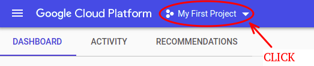
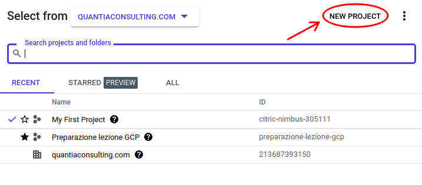
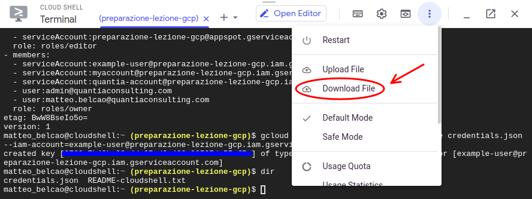
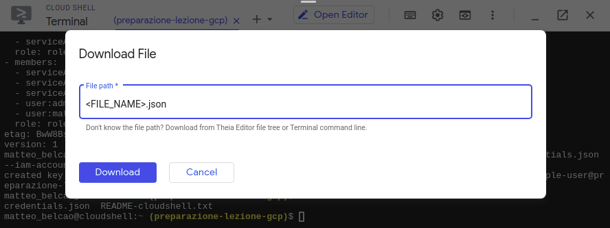
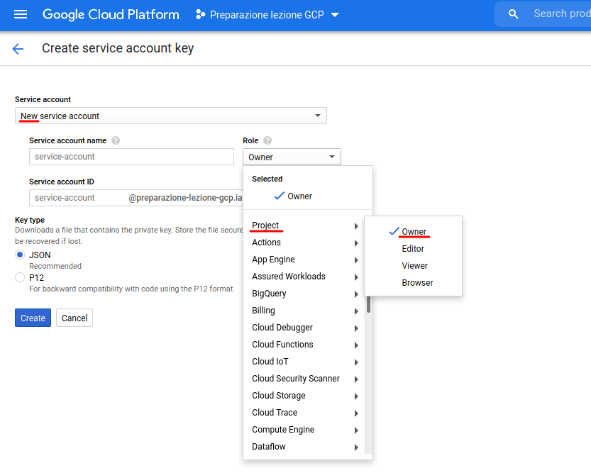
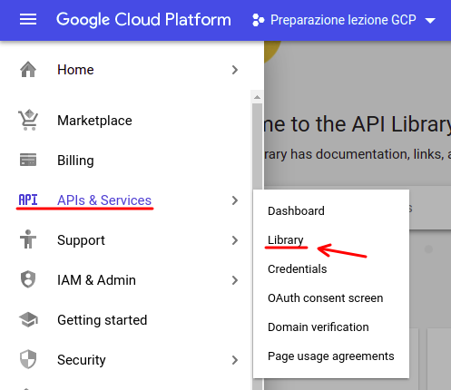
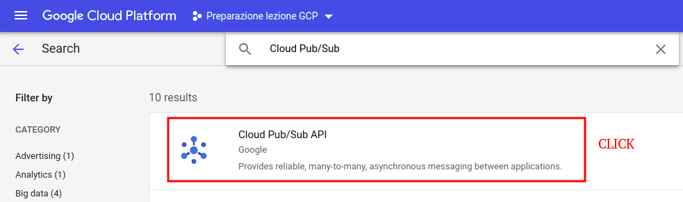
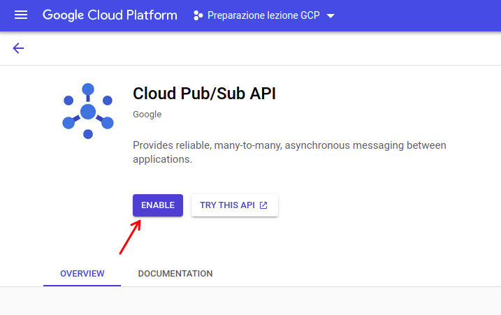

## HANDS-ON : Environment setup


We suggest to use [__Google Chrome__](https://www.google.it/intl/it/chrome) for making the exercises involving the ___Cloud Console WebUI___.

### Setup a new project

Sign-in to Google Cloud [__Platform Console__](https://console.cloud.google.com/) and select the project menu by clicking on the top bar as shown above.



The action will open a window, where you have to click on `NEW PROJECT`. Then, you have to fulfill the required fields (name, project-id, organization, location). Remember that `project ID` needs to be a unique name across all Google Cloud projects. Take note of your `project ID` as it will be needed later.



### Credentials retrieval

- __[OPTION 1](https://cloud.google.com/docs/authentication/getting-started#command-line)__: get the authentication key using the [__CLOUD SHELL__](https://cloud.google.com/shell) or the __LOCAL COMMAND LINE__

  1. Select the desired project, and click `Authorize`

    ```
    gcloud config set project <PROJECT_ID>
    ```
    <br>

  2. Create the service account. Replace `<NAME>` with a new name for the service account (must be lowercase).

    ```
    gcloud iam service-accounts create <NAME>
    ```
    <br>

  3. Grant permissions to the service account. Replace `PROJECT_ID` with your project ID

    ```
    gcloud projects add-iam-policy-binding <PROJECT_ID> --member="serviceAccount:<NAME>@<PROJECT_ID>.iam.gserviceaccount.com" --role="roles/owner"
    ```
    <br>

    If the command is successful, you should see a similar output: `Updated IAM policy for project [<PROJECT_ID>].`

  4. Generate the key file. Replace `<FILE_NAME>` with a name for the key file.

    ```
    gcloud iam service-accounts keys create <FILE_NAME>.json --iam-account=<NAME>@<PROJECT_ID>.iam.gserviceaccount.com
    ```
    <br>

    If the command is successful, you should see a similar output: `created key [......KEY_NUMBERS.....] of type [json] as[<FILE_NAME.json] for   [<NAME>@<PROJECT_ID>.iam.gserviceaccount.com]`

    __REMARK__: The key file will be generated in your current location.

  5. Only if you're using the __CLOUD SHELL__: you have to download the credentials by clicking on the `Download File` button and typing the `<FILE_NAME>.json`, as shown by the following images.

    

    

- __OPTION 2__: get the authentication key using the [__CLOUD CONSOLE WebUI__](https://console.cloud.google.com/apis/credentials/serviceaccountkey?_ga=2.265624399.1192889068.1614094418-305527351.1613488901&_gac=1.254185978.1613683561.Cj0KCQiAvbiBBhD-ARIsAGM48byDiQXIBcoIiHPvp1qk5l5buz8i3BAYnzoSO5_VZlgcrrFolqZa7LsaArX1EALw_wcB)

  Alternatively, you can use the Cloud Console graphical interface for creating a new `Owner` account. By clicking the `create` button, a `.json` file containing the authentication key will be automatically downloaded.

  


### APIs setup

In the proposed exercises, you will have to use the `Storage`, `BigQuery`, `Pub/Sub`, `Dataflow`, `Compute Engine` and `IoT Core` tools. In order for the components to cooperate with each other and being usable by automated scripts (python), it's necessary to __enable__ their __APIs__.

To enable them, you need to search for `APIs & Services` in the Cloud Console menu, and click `Library`



For each tool that needs to be enabled, it is necessary to search for it by writing his name on the top bar and click on the result to open its overview page. Then, you need to click on the `ENABLE` button to enable its API. This operation must be performed for the `Storage`, `BigQuery`, `Pub/Sub`, `Dataflow`, `Compute Engine` and `IoT Core` tools.





### Setup the environment variable (python notebooks)

You have to provide the authentication credentials to your application by setting the `GOOGLE_APPLICATION_CREDENTIALS` environment variable in your python code. We will see later on a case-by-case basis how to configure it according to the needs of each exercise. Usually, you just need to set the environment variable in the `os library`, as shown by the following code (replace `<PATH>` and `<FILE_NAME>` with the credential file location).

```python
import os

os.environ["GOOGLE_APPLICATION_CREDENTIALS"] = "<PATH>/<FILE_NAME>.json"
```
