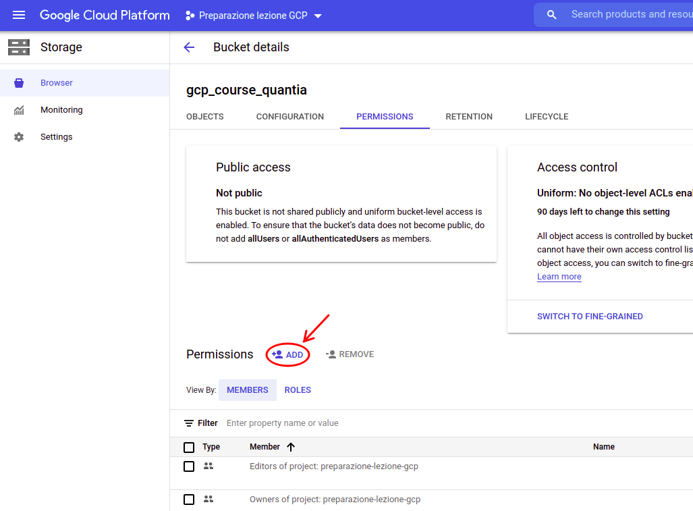

## HANDS-ON : [Cloud Storage](https://cloud.google.com/storage)

[__Documentation__](https://cloud.google.com/storage/docs/)

### __[Cloud Storage web Console](https://cloud.google.com/storage/docs/quickstart-console)__

- __Bucket setup__

  Open the google cloud console and select `Storage`. Click on `+ CREATE BUCKET`

  

  Fill the bucket with the needed information:
    - a unique bucket `name` (must be unique across all the Google Storage buckets and written in lowercase)
    - choose the `location` of the data
    - select the `storage class` (select `Standard` for this exercise)
    - choose the `access control mode` (select `Unique` for this exercise)


  Then, click on `CREATE` to allocate it.

  

- __Upload an object into the bucket__

  From the `Storage browser` console, click on the desired bucket name.

  

  The action will open the `Bucket details` section. Now, you have to click the `UPLOAD FILES` button and select the desired file from a pop-up window to upload it. You can try to upload the `test.jpg` image.

  

- __Creation of folders__

  From the `Bucket details` section, you can also create subfolders with the `CREATE FOLDER` button, or upload local folders using the `UPLOAD FOLDER` button.

  

- __Manage the bucket authorizations (public link sharing)__

  From the `Bucket details` section, open the `Permission` tab.

  

  Then, for enabling the bucket's __public visibility__, click on `+ ADD` and grant the `Cloud Storage > Storage Object Viewer` permission to `allUsers`. Click on `SAVE` to confirm.

  

  

  Now, you should be able to see the content of the bucket from public links in the following format: `https://storage.googleapis.com/YOUR_BUCKET_NAME/BUCKET_OBJECT`. For example, the bucket object `test.jpg` stored in the `gcp_course_quantia` bucket, is accessible from https://storage.googleapis.com/gcp_course_quantia/test.jpg.

  To __remove__ the bucket's public visibility, you have to tick the permission grated to `allUsers` before, and click `- REMOVE`

  

- __Download of an object__

  To download an object or folder, you have to open its `overflow menu` on the right side and click `DOWNLOAD`.

  

- __Deletion of objects / folders__

  To delete an object or folder, you have to tick it (or them if more than one) and click the `DELETE` button.

  

- __Deletion of buckets__

  To delete an entire bucket, you have to go back to the `Storage browser`. Then, tick the bucket (or buckets) you wish to remove and click the `DELETE` button.

  

### __[gsutil](https://cloud.google.com/storage/docs/quickstart-gsutil)__ tool

- __Open a terminal window__

- __[Install](https://cloud.google.com/storage/docs/gsutil_install#expandable-2) gsutil__

  ```
  sudo apt-get install python-pip

  pip install gsutil
  ```
  <br>

- __Configure gsutil__

  ```
  gsutil config -e
  ```
  <br>

  The command will open a configuration prompt similar to the one in the following image, where you will be asked to provide your ___credentials absolute path___ and a ___project-id___.

  __Hint__: You can get your absolute location using the `pwd` command in the same folder of the credentials file.

  

- __Create a new bucket__

  You can only use lowercase characters. From now on we refer to your bucket with the fictitious name `gcp_course_quantia`

  ```
  gsutil mb -b on -l europe-west3 gs://gcp_course_quantia/
  ```
  <br>

  If successful, the command returns: `Creating gs://gcp_course_quantia/...`

  If the bucket name you chose is already in use, either by you or someone else, the command returns: `Creating gs://gcp_course_quantia/...
  ServiceException: 409 Bucket gcp_course_quantia already exists.`

- __Upload an object into your bucket__

  You can use the `gsutil cp` command to copy an image from the location where you saved it to the bucket you created:

  ```
  gsutil cp ./test.jpg gs://gcp_course_quantia
  ```
  <br>

  If successful, the command returns: `Copying file://./test.jpg [Content-Type=image/jpeg]...
/ [1 files][ 72.8 KiB/ 72.8 KiB]                                                
Operation completed over 1 objects/72.8 KiB.`

- __Download the object from your bucket__

  Use the `gsutil cp` command to download the image you stored in your bucket to somewhere on your computer. The first argument is the cloud source path, while the second one is the local path to save the object

  ```
  gsutil cp gs://gcp_course_quantia/test.jpg ./test_downloaded.jpg
  ```
  <br>

  If successful, the command returns:`Copying gs://gcp_course_quantia/test.jpg...
/ [1 files][ 72.8 KiB/ 72.8 KiB]                                                
Operation completed over 1 objects/72.8 KiB.`

- __Copy the object from a bucket to a folder in the bucket__

  Use the `gsutil cp` command to create a folder and copy the image into it:

  ```
  gsutil cp gs://gcp_course_quantia/test.jpg gs://gcp_course_quantia/just-a-folder/test2.jpg
  ```
  <br>

- __List contents of a bucket or folder__

  Use the `gsutil ls` command to list the contents at the top level of your bucket:

  ```
  gsutil ls gs://gcp_course_quantia
  ```
  <br>

  or to show the content of a specific folder:

  ```
  gsutil ls gs://gcp_course_quantia/just-a-folder
  ```


- __List details for an object__

  Use the `gsutil ls` command, with the `-l` flag to get some details about one of your images:

  ```
  gsutil ls -l gs://gcp_course_quantia/test.jpg
  ```


- __Make the objects publicly accessible__

  1. Use the gsutil iam ch command to grant all users permission to read the images stored in your bucket:

    ```
    gsutil iam ch allUsers:objectViewer gs://gcp_course_quantia
    ```
    <br>

    The command is successful if no error is returned.
    Now anyone can get your objects.
    For example at https://storage.googleapis.com/gcp_course_quantia/just-a-folder/test2.jpg

  2. To remove this access, use the command:

    ```
    gsutil iam ch -d allUsers:objectViewer gs://gcp_course_quantia
    ```
    <br>

    __REMARK__: After you remove public access, you may still be able to access a cached version of one of your images for a period of time.

- __Give someone access to your bucket__

  1. Use the `gsutil iam ch` command to give a specific email address permission to read and write objects in your bucket:

    ```
    gsutil iam ch user:<<user-gcp-email>>:objectCreator,objectViewer gs://gcp_course_quantia
    ```
    <br>

    Where `<<user-gcp-email>>` is the GCP account of the user to be added

  2. To remove this permission, use the command:

    ```
    gsutil iam ch -d user:<<user-gcp-email>>:objectCreator,objectViewer gs://gcp_course_quantia
    ```


- __Delete an object__

  Use the gsutil rm command to delete one of your images:

  ```
  gsutil rm gs://gcp_course_quantia/test.jpg
  ```
  <br>

  If successful, the command returns: `Removing gs://gcp_course_quantia/test.jpg...
/ [1 objects]
Operation completed over 1 objects.  `

- __Delete the bucket__

  Use the `gsutil rm` command with the `-r` flag to delete the bucket and anything inside of it:

  ```
  gsutil rm -r gs://gcp_course_quantia
  ```
  <br>

  If successful, the command returns a message similar to: `Removing gs://gcp_course_quantia/...`

  Your bucket and its contents are deleted.


### Cloud Storage API with python

In this [__NOTEBOOK__](./GCP_Storage_handsOn.ipynb), we will show you how to use the __Cloud Storage API__ for python.

In particular, you will learn how to:
  - create a bucket
  - upload an object
  - manage permissions to grant public access to a specific object or the entire bucket
  - download an object
  - delete an object
  - delete a bucket


For reference, we leave the official [__documentation__](https://googleapis.dev/python/storage/latest/client.html) (python) for the Cloud Storage Client API

More complex example scripts are available in this official __[GitHub repository](https://github.com/GoogleCloudPlatform/python-docs-samples/tree/master/storage/cloud-client)__
