## HANDS-ON : [BigQuery](https://cloud.google.com/bigquery)

[__Documentation__](https://cloud.google.com/bigquery/docs/)

### Querying a public dataset

Bigquery has many test datasets that you can use for practicing. When you add a new dataset using the `+ ADD DATA` button in the BigQuery console, you can choose the __Explore public datasets__ option.

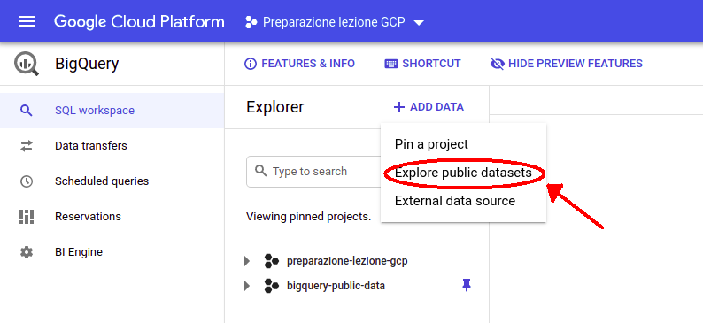

For this example we have chosen the [__GitHub repos__](https://console.cloud.google.com/marketplace/product/github/github-repos?filter=solution-type:dataset) public dataset, and in particular, the [__commits table__](https://console.cloud.google.com/bigquery?p=bigquery-public-data&d=github_repos&page=table&t=sample_commits) (you can explore the structure by clicking the link).

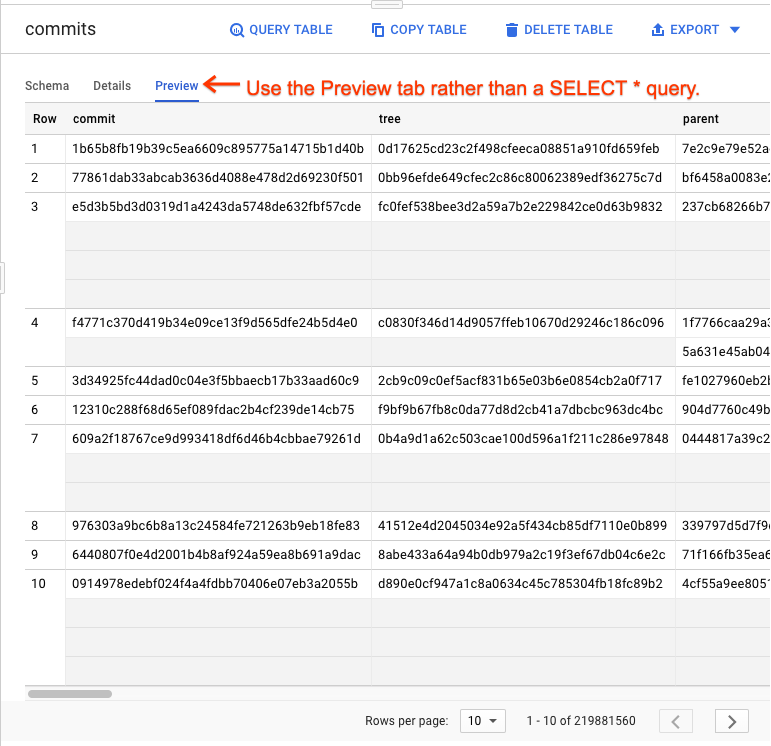

Then you can try to make some queries using the __Query Editor__. For opening it, just click the `+COMPOSE NEW QUERY` button on the top-right. This action should open a new query tab.

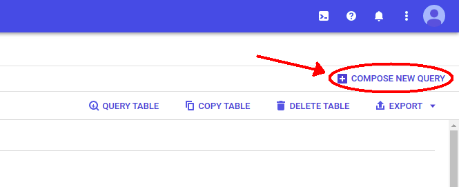

Finally, you can copypaste the code of the following query into the editor and click the `Run` button to start the computation.

```SQL
SELECT subject AS subject,
  COUNT(*) AS num_duplicates
FROM `bigquery-public-data.github_repos.sample_commits`
GROUP BY subject
ORDER BY num_duplicates DESC
LIMIT 100
```

Here is an example of how the editor should be like after the execution.

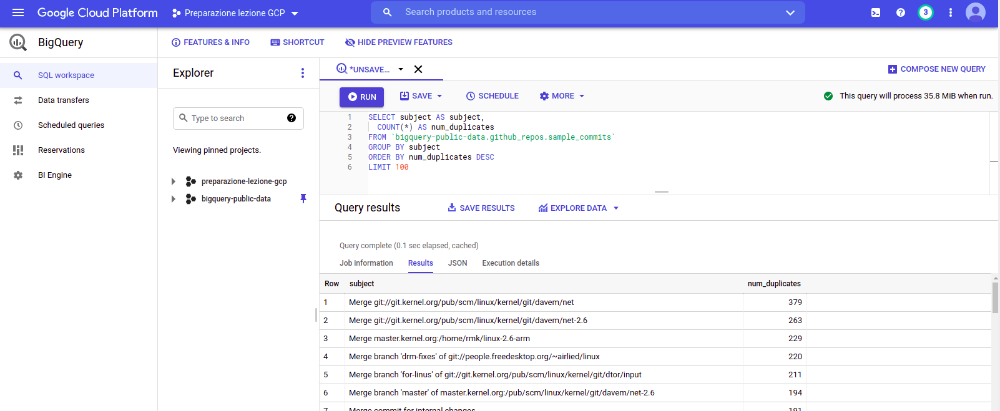

References: [Use BigQuery to query GitHub data](https://codelabs.developers.google.com/codelabs/bigquery-github#0)


### Querying a Cloud Storage external table

Bigquery is able to query data from structured data sources (Avro, CSV, JSON, ORC, Parquet, Firestone). In this specific tutorial, we will see how to create a BigQuery external table starting from a CSV file persisted in Google Store. For this example we have used the `Netflix dataset`.

An [__external data source__](https://cloud.google.com/bigquery/external-data-sources?hl=it) (also known as a federated data source) is a data source that you can query directly even though the data is not stored in BigQuery. Instead of loading or streaming the data, you create a table that references the external data source.

First of all, we need to create a new __bucket__ on Google Storage. You can use the WebUI as shown above to upload the `netflix_titles.csv` file

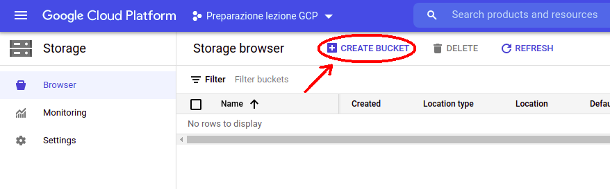

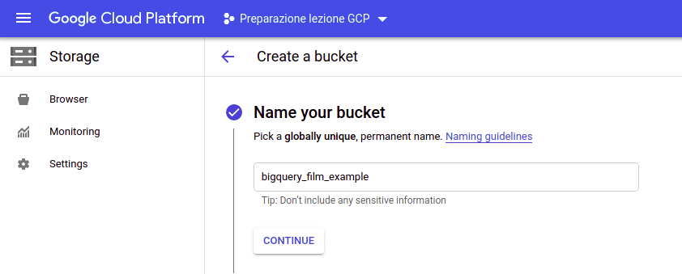

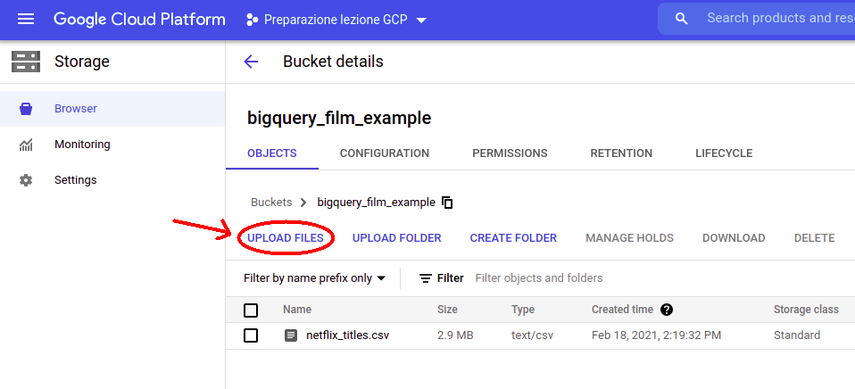

In this example, the shared path to the `netflix_titles.csv` stored in the bucket will be `gs://bigquery_film_example/netflix_titles.csv`

Then, you have to switch to BigQuery in order to create a new __dataset__ (we call it `FILMS_DS`)

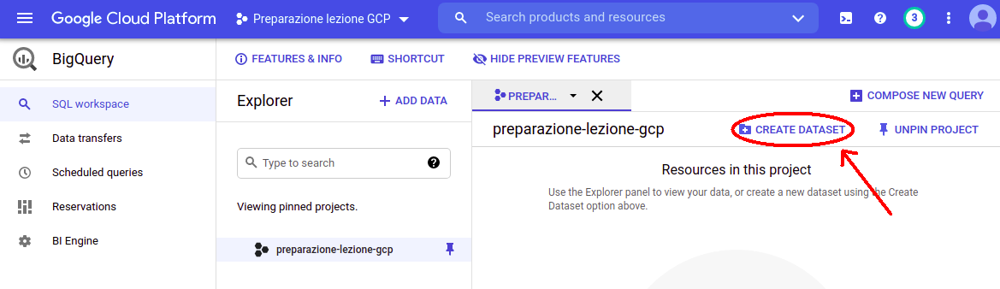

Finally, you can create a new __external table__ from a Google Data Source file, that we have called `NETFLIX`

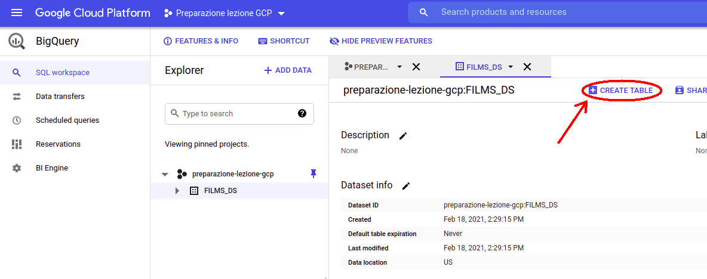

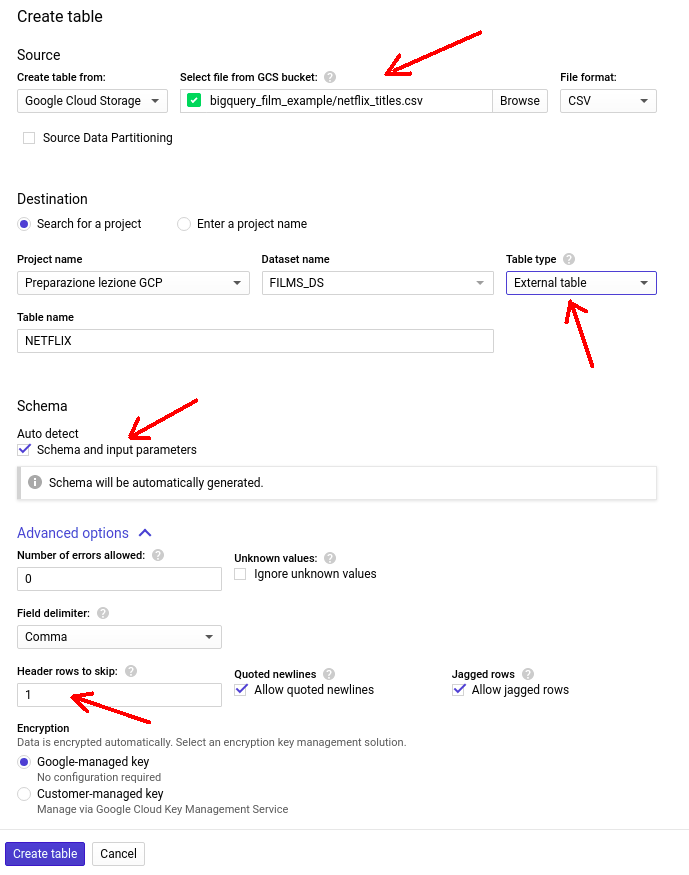

Note that, we use the __schema auto-detection__ option and we skip the first row of the CSV file as there are stored the header names.

Now, you can try to make some queries using the __Query Editor__. For opening it, just click the `+COMPOSE NEW QUERY` button on the top-right. This action should open a new query tab.


For example, you can try to execute the following query. You can copypaste it into the query editor and click the `RUN` button to start the computation.

```SQL
SELECT type, count(*) AS CNT
FROM `preparazione-lezione-gcp.FILMS_DS.NETFLIX`
WHERE release_year >= 2015 AND country = "United Kingdom"
GROUP BY type
```

You should see an output like this one.

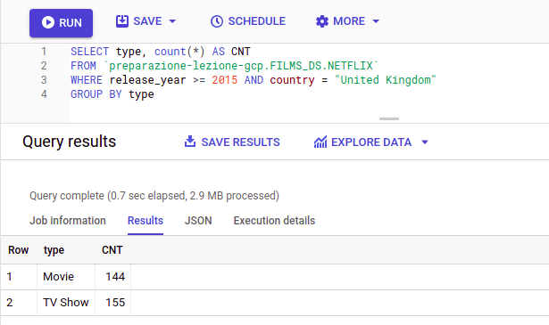

References: [__BigQuery explained: Data Ingestion__](https://cloud.google.com/blog/topics/developers-practitioners/bigquery-explained-data-ingestion), [BigQuery external data sources](https://cloud.google.com/bigquery/external-data-sources), [Querying Cloud Storage data](https://cloud.google.com/bigquery/external-data-cloud-storage#console).


### BigQuery API with python

In this [__NOTEBOOK__](./GCP_BigQuery_handsOn.ipynb), you will learn how to use the __BigQuery API__ for python.

In particular, you will learn how to:

  - create a storage bucket, load the CSV file (LAB __exercise__)
  - create a dataset
  - create a table (ingest CSV data from Cloud Storage)
  - query a table
  - query a table using the [__pandas-gbq__](https://pandas-gbq.readthedocs.io/en/latest/index.html) library, plot the results
  - delete a bucket (LAB __exercise__)
  - delete a table
  - delete a dataset


For reference, we leave the official [__documentation__](https://googleapis.dev/python/bigquery/latest/index.html) (python) for the BigQuery Client API

Additional API references: [CSV ingestion with BigQuery API](https://cloud.google.com/bigquery/docs/loading-data-cloud-storage-csv), [BigQuery batch loading data](https://cloud.google.com/bigquery/docs/batch-loading-data), [BigQuery batched query jobs](https://cloud.google.com/bigquery/docs/running-queries).

### BigQuery API exercise

In this [__EXERCISE-NOTEBOOK__](./GCP_BigQuery_ingestion_exercise.ipynb), you will be asked to:

- create a new dataset
- create a table (ingest the CSV file `people-with-dups.txt`)
- query the table: extract the average salary for each gender
- delete the dataset
