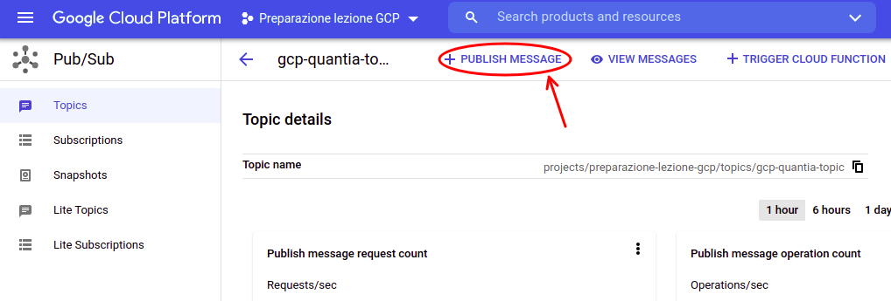
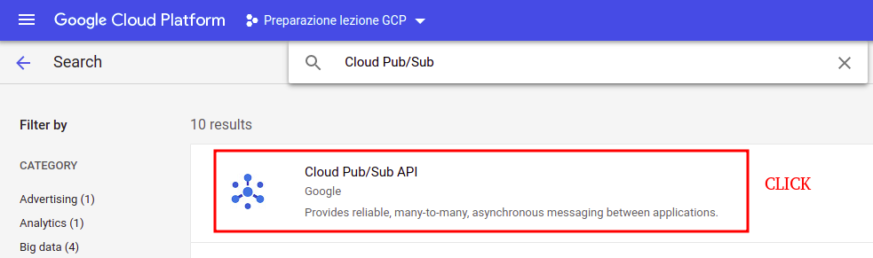
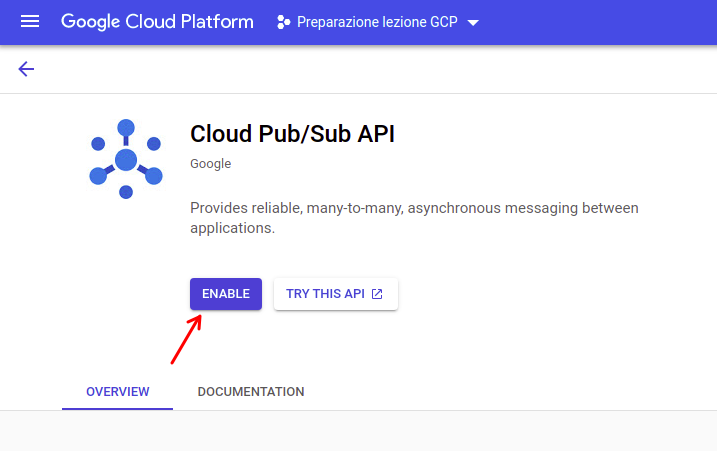

## HANDS-ON : [Pub/Sub](https://cloud.google.com/pubsub)

[__Documentation__](https://cloud.google.com/pubsub/docs/)

### Command-line Pub/Sub

You can use the [__cloud shell__](https://cloud.google.com/shell) for running this tutorial.

- __Set your actual project. You need to substitute `<PROJECT_ID>`.__

  ```
  gcloud config set project <PROJECT_ID>
  ```


- __Create a topic with the ID `gcp-quantia-topic`__

  ```
  gcloud pubsub topics create gcp-quantia-topic
  ```


- __Create a pull subscription with ID `my-sub` and attach it to `gcp-quantia-topic`__

  ```
  gcloud pubsub subscriptions create my-sub --topic=gcp-quantia-topic
  ```


- __Listing all the topic and subscriptions registered in Pub/Sub__
  ```
  gcloud pubsub topics list

  gcloud pubsub subscriptions list
  ```


- __Publish a message to `gcp-quantia-topic`__

  ```
  gcloud pubsub topics publish gcp-quantia-topic --message="Hello. This is a test message."
  ```


- __Receive the message from `my-sub`__

  The `gcloud` tool prints the message to the command line.

  ```
  gcloud pubsub subscriptions pull my-sub --auto-ack
  ```


- __Delete topic and subscriber__

  ```
  gcloud pubsub topics delete gcp-quantia-topic

  gcloud pubsub subscriptions delete my-sub
  ```


If you  want to learn more about the topic/subscription command line syntax, you can get it by writing `gcloud pubsub topics --help` and `gcloud pubsub subscriptions --help` on the terminal.

Reference: [Quickstart using the gcloud command-line tool](https://cloud.google.com/pubsub/docs/quickstart-cli)


### [Pub/Sub web Console](https://cloud.google.com/pubsub/docs/quickstart-console)

You can also use the Pub/Sub WebUI to manage the Pub/Sub components. In particular, in this tutorial we will show you how to achieve the same results obtained using the command-line in the previous exercise.

- __Create a topic with the ID `gcp-quantia-topic`__

  

  


- __Create a pull subscription with ID `my-sub` and attach it to `gcp-quantia-topic`__

  

  

  __REMARK__: you can set a custom `retention time` for the unacknowledged messages as shown in the following image. In addition, it's also possible to extend the retention policy to acknowledged messages.

  

- __Publish a message to `gcp-quantia-topic`__

  Go to the __topics__ section, and click on the `gcp-quantia-topic` to open the __topic details__ page. You can now click on the `+ PUBLISH MESSAGE` button to create a new message.

  

  The action will open a window where you can fill the __message body__ field with a text of your choice (ex. `Hello. This is a test message.`).
  To confirm the creation, click the `PUBLISH` button on the bottom to start the propagation among the subscribers.


- __Receive the message from `my-sub`__

  Go to the __subscriptions__ section, and click on the `my-sub` subscription to open the __subscription details__ page. You can now click on the `VIEW MESSAGES`.

  Then, you can click the `PULL` button to read the messages.

  

  

  __REMARK__: to acknowledge the receiver that you have read the message, you have to tick the `Enable ack messages` and click the `ACK` button on the right of each desired message. An acked message will not be pulled anymore from the specific subscriber. If you don't ACK the message, you will be able to pull the message until the message itself will be expired (see the `Message retention duration` parameter set during the subscriber creation phase)  

- __Delete topic and subscriber__

  You can delete both topics and subscribers by going to the respective sections, ticking them, and clicking `DELETE` on the top menu.

  


### Pub/Sub API with python

In this [__NOTEBOOK__](./GCP_Pub_Sub_handsOn.ipynb), you will learn how to use the __Pub/Sub API__ for python.

In particular, you will learn how to:

- Create/Delete a topic
- Listing all the available topics
- Create/Delete a subscriptions
- Listing all the available subscriptions
- Publish text messages
- Receiving text messages

For reference, we leave the official [__documentation__](https://googleapis.dev/python/pubsub/latest/index.html) (python) for the Pub/Sub Client API.

We also leave the following links to the official documentation to further explore the concepts (or try to use a different programming language): [Managing topics and subscriptions](https://cloud.google.com/pubsub/docs/admin), [Using Client Libraries](https://cloud.google.com/pubsub/docs/quickstart-client-libraries)


### Pub/Sub API exercise - structured JSON data

In this __LAB exercise__, you will be asked to:

  - create a new publisher
  - create a new subscriber
  - send JSON messages using the publisher
  - pull the messages using the subscriber
  - delete the publisher/subscriber

You can find here the link of the two notebooks to be completed : [__NOTEBOOK-PUBLISHER__](./GCP_Pub_Sub_JSON_publisher.ipynb) and [__NOTEBOOK-SUBSCRIBER__](./GCP_Pub_Sub_JSON_subscriber.ipynb).


### [Stream ingestion of Pub/Sub data into BigQuery](https://codelabs.developers.google.com/codelabs/iotcore-heartrate#0)

This is the last exercise of this session, and we want to show you a more complex exercise involving several GCP tools (Cloud Storage, Pub/Sub, BigQuery, Dataflow and Compute Engine) to show you a simulation of an __ingestion__ task of __IoT heartrate streaming data__ in order to make them available into BigQuery for performing further analytical tasks.

- __APIs setup__

    In this exercise we will have to use the `Pub/Sub`, `Dataflow`, `Compute Engine` and `IoT Core` tools. In order for components to cooperate with each other, it's necessary to __enable__ their __APIs__.

    To enable them, you need to search for `APIs & Services` in the Cloud Console menu, and click `libraries`

    

    For each tool that needs to be enabled, it is necessary to search for it by writing his name on the top bar and click on the result to open its overview page. Then, you need to click on the `ENABLE` button to enable its API. This operation must be performed for the `Pub/Sub`, `Dataflow`, `Compute Engine` and `IoT Core` tools.

    

    


- __BigQuery setup__

    The BigQuery table will be used later for storing the streamed data coming from IoT devices and making analytical queries on them.

    The first thing to do is to create a __new dataset__, which we will call `heartRateData`.

    

    Then, you have to create a __new table__ called `heartRateDataTable`. During the creation phase, we need to specify all its fields as shown in the following configuration.

    

    If the table creation is successful, you should see a schema description similar to this one.

    

    __REMARK__: the created table of the example has a the following __table ID__: `preparazione-lezione-gcp:heartRateData.heartRateDataTable` (which adops the `<project-id>:<datset-name>.<table-name>` covention). This information will be necessary later for the [Cloud Dataflow](https://cloud.google.com/dataflow/) configuration.

- __Pub/Sub setup__

    In this example, we will use Pub/Sub for handling incoming IoT messages generated by a simulated IoT device.

    First of all, you need to create a __new topic__, which we will call `heartratedata`.

    

    Then, you have to create a __subscriber__, which will have the task of reading the messages of the topic generated before. We will also call this subscriber `heartratedata`

    

    __REMARK__: The complete identifiers of the topic and the subscription are respectively `projects/preparazione-lezione-gcp/topics/heartratedata` and `projects/preparazione-lezione-gcp/subscriptions/heartratedata`.  This information will be necessary later for the [Cloud Dataflow](https://cloud.google.com/dataflow/) configuration.

- __Temporary bucket setup__

    `Dataflow` will need a location to store temporary files, so we will provide a location in Google Cloud Storage. From the Cloud Console, select Storage and click on the `+ CREATE BUCKET` button.

    

    __REMARK__: The bucket's name must globally unique across all of Google Cloud. In this example his unique name is `iot-heartrate-temp-quantia`, which corresponds to the `gs://iot-heartrate-temp-quantia` unique link .


- __Dataflow setup__

    Cloud computing has made possible fully managed models of computing where logic can be created easily. For this lab, a [__Dataflow__](https://cloud.google.com/dataflow?hl=it) template will be used to create a process that monitors a `Pub/Sub` topic for incoming messages and then moves them to `BigQuery`. Dataflow will need a location to store temporary files, so we will provide a location in `Cloud Storage`.

    Click on `Create Job from Template`.

    

    Name the job `iot-heartrate-temp` and select the Pub/Sub Subscription to Big/Query template. __Make sure the Regional endpoint matches where the rest of your project resources are located__. Fill all the other fields making sure that they are aligned with the name of your Storage bucket, Pub/Sub subscription and BigQuery table. Click on `Run Job`.

    


- __IoT Core registry setup__

    [__Cloud IoT Core__](https://cloud.google.com/iot-core) is a service designed to connect, manage, and ingest data from millions of globally dispersed devices. Cloud IoT Core is the central service that, when combined with other services on Google Cloud IoT platform, provides a complete solution for collecting, processing, analyzing, and visualizing IoT data in real-time.

    For setting up the register, you need to go to `IoT Core` from the Cloud Console, and click on the `+ CREATE REGISTRY` button.

    

    Then, you need to set the registry ID (we called it `heartrate`), the region and flag the `MQTT` protocol.  ___Remember to keep the Region matching the other components' location.___

    

- __Simulated IoT streaming device setup__

    We will use [__Compute Engine__](https://cloud.google.com/compute) for allocating a virtual machine, used for running a python script that generates the heartrate data.

    Form the cloud Console go to `Compute Engine`, and click on `+ CREATE INSTANCE`.

    

    It's not required a VM with particular features or performance is not required, so we will choose a `General-Purpose` one (you can choose for example an `e2-medium`). Click on `CREATE`.

    If the creation is successful, you should see ___two VM instances running___, which are the `Compute Engine VM` and the `Dataflow instance`.

    

    Once the VM has started, click the `SSH link` to connect to the __VM terminal__. Then, run the following commands to install the needed packages.

    ```
    sudo apt-get update
    sudo apt-get install git
    ```
    <br>

    Then, you need to clone the heartrate data generator script from a remote repository and make sure that the required core packages are installed.

    ```
    git clone https://github.com/googlecodelabs/iotcore-heartrate
    cd iotcore-heartrate

    chmod +x initialsoftware.sh
    ./initialsoftware.sh
    ```
    <br>

    In order to connect the `data generator` with `IoT Core`, a __security certificate__ must be generated and then registered as an `IoT Core Device`.

    ```
    chmod +x generate_keys.sh
    ./generate_keys.sh

    cat ../.ssh/ec_public.pem
    ```
    <br>

    You should see a generated public key printed on the terminal in a way similar to this one. Please select and copy the printed key (headers included) using `CTRL-C` and ___remember to keep the terminal open___.

    

- __IoT Core Device setup__

    Now, we need to register the heartrate data generator. Return in [__Cloud IoT Core__](https://cloud.google.com/iot-core), click on your register ID, and go to the `Devices` section.

    

    Then, click on `+ CREATE DEVICE`. Assign a `device-ID` and set the `Authentication Key` as `ES256` and paste credentials you copied from the terminal on the previous point.

    

    Click `CREATE`. You should see the device instantiated.

    


- __Start the data generator__

    You can start the data generator by running this command on the shell of your VM instance (if you closed it, you have to go back to `Compute Engine` to open a new SSH terminal). Remember to change `<PROJECT-ID>`, `<REGISTRY-ID>`, `<DEVICE-ID>` with your parameters.

    ```
    python heartrateSimulator.py --project_id=<PROJECT-ID> --registry_id=<REGISTRY-ID> --device_id=<DEVICE-ID> --private_key_file=../.ssh/ec_private.pem
    ```
    <br>

    For example, using the ID of the components instantiated in the previous steps, you should run the following command: `python heartrateSimulator.py --project_id=preparazione-lezione-gcp --registry_id=heartrate --device_id=simulated-device --private_key_file=../.ssh/ec_private.pem`

    If everything works correctly, you should see the generated data printed in the terminal, and finally the word "Finished" without any error message.

- __Check ingested data__

    Go to BigQuery, select the table you ingested the data (we called it `heartRateDataTable` in this example). Click on `QUERY TABLE`.

    Check that the data has flowed correctly into the table, for example by writing a simple "SELECT *" query. You should see some query results in the output.

    


- __Stop the VMs__

    Remember to stop the VM instances when you end the exercise, or you will keep paying their rental fees.

    1. For stopping the data generator __VM instance__, you have to go back to [Compute Engine](https://cloud.google.com/compute), tick the `instance-ID` and click the `STOP` button on the top bar.

    2. For stopping a __Dataflow task__ you need to go back to the [Dataflow](https://cloud.google.com/dataflow) job panel, click on the `job-ID` and open its details. Then, you have to click `STOP` and select `Cancel`.

    
